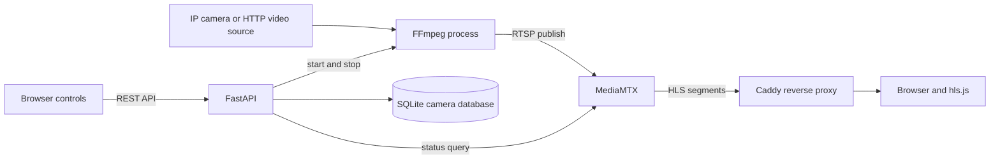

# AI CCTV Platform: Project Guide

This guide explains the current project structure, how a camera stream moves through the system, how to run the services locally, and what each source file is responsible for.

## 1. What the project does

The application is a local CCTV stream-control and viewing platform. It lets an operator register camera connection details, start or stop a camera relay, check whether MediaMTX sees the stream, and view online streams in a browser.

The current implementation handles camera metadata and video transport. Despite the project name, it does not currently run object detection, event recognition, or other AI inference.

The main path is:



## 2. How a stream works

1. The operator registers a camera through `POST /api/cameras`. The API stores its ID, display name, protocol, URL, and optional camera credentials in SQLite.
2. The browser requests `GET /api/cameras` and renders one card per registered camera.
3. When Start is selected, the browser calls `POST /api/cameras/{camera_id}/start`.
4. FastAPI loads that camera record and passes the configured `stream_url` and separate username/password fields to `stream_manager`.
5. `StreamManager` constructs the source URL, starts an FFmpeg subprocess, and publishes to MediaMTX at `rtsp://<MediaMTX host>:8554/<camera_id>` using RTSP over TCP.
6. MediaMTX exposes the published path as HLS on port `8888` and WebRTC on port `8889`. The API checks MediaMTX's control API on port `9997` to determine whether the path is online.
7. The browser checks `GET /api/cameras/{camera_id}/stream`. If the path is online, `frontend/index.html` attaches hls.js to `/hls/{camera_id}/index.m3u8`.
8. Caddy forwards `/hls/*` to MediaMTX. The UI also polls camera status every five seconds and updates its online count.

The API's `starting` response means FFmpeg was launched, not that a camera has already produced playable video. The subsequent MediaMTX status check is what confirms that the stream path is online.

## 3. Local setup

### Prerequisites

- Python 3.10 or newer is recommended. The source uses modern union type syntax such as `str | None`.
- FFmpeg must be installed and available as `ffmpeg` on `PATH`.
- MediaMTX must be installed and running with this repository's `mediamtx.yml` configuration.
- The active FFmpeg command selects the `h264_amf` encoder. This requires a compatible AMD GPU/driver and an FFmpeg build with AMF support. If that encoder is unavailable, change the encoder settings in `stream_manager.py` to match the host machine.
- Caddy is optional for the API alone, but the checked-in browser UI expects the Caddy routes described below.

### Install Python dependencies

Run these commands in PowerShell from the repository root:

```powershell
py -m venv .venv
.\.venv\Scripts\Activate.ps1
python -m pip install -r requirements.txt
```

If PowerShell blocks activation for the current terminal, run:

```powershell
Set-ExecutionPolicy -Scope Process -ExecutionPolicy RemoteSigned
.\.venv\Scripts\Activate.ps1
```

### Initialize the database

```powershell
python init_db.py
```

This creates the `cameras` table if it does not exist. The configured SQLite URL is `sqlite:///./cctv.db`, which is relative to the process's current working directory. Start the application from the project root so it uses the expected database file. `create_all` creates missing tables; it is not a schema migration system.

### Start the services

Run each service in its own terminal:

```powershell
# Terminal 1: MediaMTX
mediamtx.exe mediamtx.yml
```

```powershell
# Terminal 2: FastAPI
.\.venv\Scripts\Activate.ps1
uvicorn main:app --host 127.0.0.1 --port 8001 --reload
```

```powershell
# Terminal 3: Caddy, if installed
caddy run --config Caddyfile
```

Open `https://localhost` for the UI when Caddy is running. The Caddy configuration uses an internally-issued local TLS certificate, so the browser may need to trust Caddy's local CA. The FastAPI health response is at `http://127.0.0.1:8001/health`, and the interactive API reference is at `http://127.0.0.1:8001/docs`.

MediaMTX is configured for RTSP on `8554`, HLS on `8888`, WebRTC on `8889`, and its API on `127.0.0.1:9997`. These ports and credentials must agree with `mediamtx.yml`, `main.py`, and `stream_manager.py`.

## 4. Registering a camera

`POST /api/cameras` expects a JSON body like:

```json
{
  "camera_id": "cam1",
  "name": "Front entrance",
  "manufacturer": "Example vendor",
  "protocol": "RTSP",
  "host": "192.168.1.50",
  "port": 554,
  "stream_url": "rtsp://192.168.1.50:554/Streaming/Channels/101",
  "username": "camera-user",
  "password": "camera-password"
}
```

Required fields are `camera_id`, `name`, `protocol`, and `stream_url`. `manufacturer`, `host`, `port`, `username`, and `password` are optional. `protocol` accepts `RTSP`, `HTTP`, or `HTTPS`; it must match the scheme in `stream_url`. `camera_id` is unique and is also used as the MediaMTX path name. Use a simple path-safe ID such as `cam1`.

The API uses `stream_url` as the complete camera source URL. The separate `host` and `port` values are stored as metadata; the stream manager does not use them to build the source URL.

## 5. HTTP API reference

| Method | Path | Purpose |
| --- | --- | --- |
| `GET` | `/` | Service name, version, and links to docs and health. |
| `GET` | `/health` | Basic process health response. It does not verify MediaMTX or camera health. |
| `GET` | `/api/cameras` | List camera records and the total count. |
| `GET` | `/api/cameras/{camera_id}` | Return one camera by its string camera ID. |
| `GET` | `/api/cameras/{camera_id}/status` | Query MediaMTX and report `online`, `offline`, or `unknown`. |
| `GET` | `/api/cameras/{camera_id}/stream` | Return status and local WebRTC/HLS URLs when the path is online. |
| `POST` | `/api/cameras` | Validate and register a camera. Duplicate IDs return HTTP 409. |
| `POST` | `/api/cameras/{camera_id}/start` | Start the FFmpeg relay for a registered camera. |
| `POST` | `/api/cameras/{camera_id}/stop` | Stop the relay if the camera has a tracked process. |

Unknown camera IDs return HTTP 404 for camera operations. Invalid or mismatched protocols return HTTP 400. If the MediaMTX API cannot be reached, the status and stream endpoints return `status: "unknown"` with `online: false`.

There are currently no camera update or delete endpoints, no API authentication, and no pagination.

## 6. Source files

| File | Responsibility |
| --- | --- |
| `main.py` | FastAPI application, CORS settings, request schema, camera CRUD-like reads/registration, MediaMTX status lookup, and start/stop routes. It calls the stream manager and serializes database records into API responses. |
| `stream_manager.py` | Owns the in-memory map of camera IDs to FFmpeg subprocesses. Builds source URLs, starts FFmpeg, monitors its stderr, reports running processes, and terminates processes. The active implementation is below an older commented-out version in the same file. |
| `models.py` | SQLAlchemy `Camera` model. Defines camera identity, display and connection metadata, stream URL, and optional credentials. |
| `database.py` | SQLite engine, SQLAlchemy declarative base, and session factory. |
| `init_db.py` | Imports the model and calls `Base.metadata.create_all` to create tables. |
| `frontend/index.html` | Current operator UI. Loads camera cards, calls the API, starts/stops streams, plays HLS with hls.js, and refreshes statuses. |
| `frontend/index_webrtc_backup.html` | Older saved frontend implementation/reference. It is not the active page served by the Caddy root configuration. |
| `mediamtx.yml` | MediaMTX listener ports, HLS/WebRTC settings, API address, local authentication, and explicitly named camera paths. The file also retains an older commented configuration block. |
| `Caddyfile` | Serves files from `frontend`, proxies `/api/*` to FastAPI, `/hls/*` to MediaMTX HLS, and `/streams/*` to MediaMTX WebRTC. Enables Caddy's internal TLS for `localhost`. |
| `requirements.txt` | Python package dependencies: FastAPI, Uvicorn, Requests, SQLAlchemy, and Pydantic. FFmpeg, MediaMTX, and Caddy are external executables and are not installed by pip. |
| `test_fps.py` | Old FPS unit-test scaffold. It calls `main.calculate_fps`, which is not defined in the current `main.py`. |
| `test_stream_manager.py` | Commented-out manual stream example; it currently contains no active automated tests. |
| `cctv.db` | Local SQLite database file. Its contents depend on the cameras registered in this workspace. |
| `cookies.txt` | Cookie data file; it is not used by the current Python modules. Treat it as sensitive if it contains real session cookies. |
| `public.html`, `test-local.html`, `-i` | Empty placeholder files in the current checkout; they are not used by the application. |
| `.gitignore` | Excludes the virtual environment, Python cache directories, and compiled Python files. |

## 7. Important implementation details

### API and persistence

- The `Camera` table uses an integer database primary key and a separate unique `camera_id` string used by API routes and MediaMTX paths.
- Each endpoint opens a SQLAlchemy session and closes it in a `finally` block.
- Camera credentials are stored in SQLite as ordinary string columns. The API response dictionaries omit the separate `username` and `password` fields, but they do return `stream_url`; do not embed secrets in that URL if the response may be exposed.
- The app has no automatic startup database initialization. Run `init_db.py` before first use.

### Stream processing

The active FFmpeg command in `stream_manager.py` currently:

- Reads the source URL supplied by the camera record.
- Adds URL-encoded username/password credentials when both are supplied.
- Scales video to `1280x720` and sets the output frame rate to 15 fps.
- Encodes video using `h264_amf`, targets a 1 Mbps constant bitrate, and sets a 15-frame GOP.
- Disables audio and publishes RTSP over TCP to MediaMTX.

The stream manager is process-local and in-memory. Restarting FastAPI loses its process map; it does not restore active streams. `stop_all()` exists but is not currently wired to an application shutdown hook. FFmpeg's process launch can succeed even if it subsequently fails to open the camera or encoder; inspect the backend console for its logged stderr.

### Browser and routing

The active page uses HLS, not WebRTC. It fetches the stream endpoint to check online state, then constructs its own HLS URL through `/hls/...`; it does not use the absolute WebRTC/HLS URLs returned by that endpoint. `hls.js` is loaded from a public CDN, with native HLS playback used when supported by the browser.

`API_BASE` in the UI is an empty string, so API and HLS requests are relative to the page's origin. The intended setup is therefore to serve the page through Caddy, which routes those paths to the correct services. Merely opening the HTML file or serving it from VS Code Live Server on port 5500 does not proxy `/api` or `/hls`; CORS permission alone does not provide that proxying.

## 8. Configuration and security notes

- The MediaMTX API username/password and the RTSP publishing username/password are hard-coded in the Python/YAML configuration. Replace them with environment-based secrets before using this outside a trusted local development setup, and rotate any credentials that have been shared.
- The camera API has no authentication or authorization. Do not expose it directly to the public internet.
- Camera usernames and passwords are stored without encryption in SQLite. Protect the database file and backups.
- MediaMTX permits read access for an anonymous internal user and allows cross-origin HLS/WebRTC requests in this configuration. Restrict these settings for non-local deployments.
- Caddy's frontend root is an absolute Windows path (`D:\pyy.intern\frontend`); update it when running from a different checkout or operating system.
- The `mediamtx.yml` file lists `cam1`, `cam-hik1`, `cam-hik2`, and `cam-hik3` as publisher paths. If a newly registered camera cannot publish, check that its ID is accepted by the active MediaMTX path configuration.
- Review `cookies.txt` and `cctv.db` before sharing or publishing the repository; they may contain sensitive or environment-specific data.

## 9. Tests and troubleshooting

The current repository does not have a functioning automated test suite. `test_stream_manager.py` is entirely commented out. `test_fps.py` references a helper that is absent from `main.py`, so it needs updating before it can be used as a valid test. No tests are run automatically when the server starts.

Useful checks when a stream does not play:

1. Confirm MediaMTX is running and its API responds at `http://127.0.0.1:9997`.
2. Confirm the camera source URL is reachable from the machine running FFmpeg and that the credentials are correct.
3. Confirm `ffmpeg` is on `PATH` and the installed build supports `h264_amf`; inspect FastAPI's terminal output for FFmpeg errors.
4. Check that the camera ID matches a usable path in `mediamtx.yml` and that MediaMTX reports it as online.
5. Check that FastAPI is listening on `127.0.0.1:8001` and that Caddy can proxy to it.
6. Open the UI through Caddy so its relative `/api` and `/hls` requests reach the right services.
7. Inspect browser developer tools for HLS/network errors. MediaMTX may be online before enough HLS data is available for playback.

## 10. Current limitations

- No AI inference or detection pipeline is implemented.
- No authentication, roles, camera editing/deletion, or persistent FFmpeg job supervision exists.
- Stream transcoding settings are fixed in source and hardware-specific.
- The frontend only plays HLS, even though the backend also returns a WebRTC URL and Caddy has a WebRTC proxy route.
- The MediaMTX status is polled per camera; it is not a push notification or application-level health check.
- Database schema changes require a migration strategy; `create_all` does not alter existing tables.